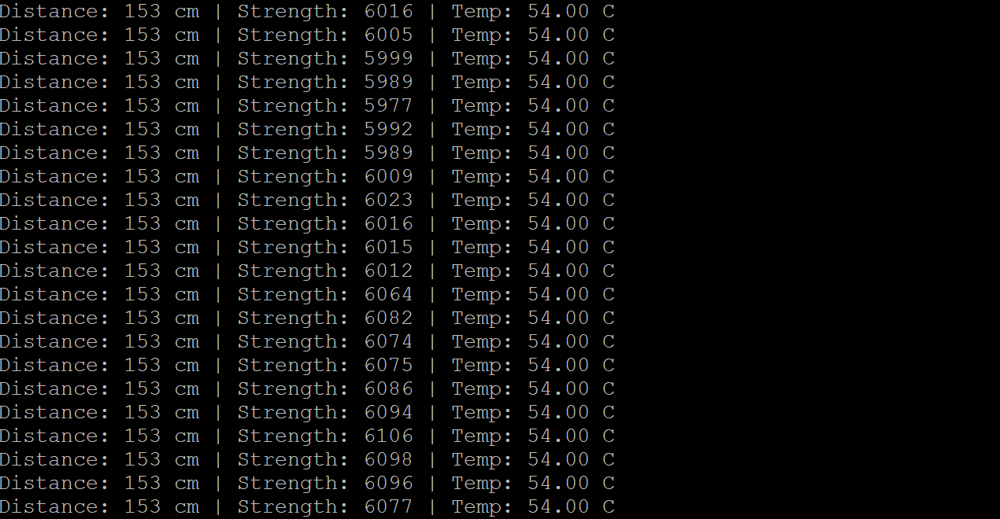

# TF-Luna LiDAR with STM32 (Nucleo-L476RG) — Setup & Debug Guide

## 📌 Overview

This project connects a TF-Luna LiDAR sensor to an STM32 Nucleo-L476RG using UART communication. The system reads distance data from the sensor and displays it on a PC terminal (PuTTY).

---

## 🧰 Hardware Setup

### Connections

| TF-Luna Pin | STM32 Pin        | Description        |
|-------------|------------------|--------------------|
| TX          | PA10 (USART1_RX) | Sensor → MCU data  |
| RX          | PA9 (USART1_TX)  | MCU → Sensor       |
| 5V          | 5V               | Power              |
| GND         | GND              | Ground             |

> ⚠️ **Important:**
>
> - TX connects to RX (crossed)
> - TF-Luna Pin 5 must **NOT** be grounded (or it switches to I2C mode)

---

## ⚙️ STM32CubeMX Configuration

### UART Setup

#### USART2 (PC / PuTTY)

- Mode: Asynchronous
- Baud Rate: 115200
- 8 data bits, no parity, 1 stop bit
- Used for debugging output

#### USART1 (TF-Luna)

- Mode: Asynchronous
- Baud Rate: 115200
- Interrupt enabled

### NVIC Settings

Enable:

```c
USART1 global interrupt
```

---

## 🖥️ PuTTY Setup

- Connection Type: Serial
- COM Port: (e.g., COM8)
- Speed: 115200

---

## 🧠 Software Design

### Data Flow

1. TF-Luna continuously sends 9-byte frames
2. STM32 receives bytes via UART interrupt
3. Bytes are assembled into a frame
4. Frame is validated using checksum
5. Parsed data is printed to PC

### TF-Luna Frame Format

```c
Byte 0: 0x59       (Header)
Byte 1: 0x59       (Header)
Byte 2: Distance Low
Byte 3: Distance High
Byte 4: Strength Low
Byte 5: Strength High
Byte 6: Temp Low
Byte 7: Temp High
Byte 8: Checksum
```

---

## 🧪 Debugging Process — Key Problems & Fixes

### 🔴 Problem 1: Nothing showing in PuTTY

**Cause:** Wrong UART used for printing

**Fix:** Changed:

```c
HAL_UART_Transmit(&huart1, ...)
```

To:

```c
HAL_UART_Transmit(&huart2, ...)
```

> ✅ **Insight:** On Nucleo boards, USART2 is connected to the ST-Link USB (PC)

---

### 🔴 Problem 2: Interrupt not working

**Cause:** UART interrupt not enabled in CubeMX

**Fix:** Enabled:

```c
USART1 global interrupt
```

---

### 🔴 Problem 3: No sensor data (no RX trigger)

**Cause:** UART receive interrupt not started

**Fix:** Added:

```c
HAL_UART_Receive_IT(&huart1, &tf_rx_byte, 1);
```

---

### 🔴 Problem 4: Only "Checksum error"

**Cause:** UART stream misalignment (reading mid-frame)

**Fix:** Implemented robust frame synchronization. Instead of assuming alignment, the code:

- Continuously scans for `0x59 0x59`
- Resynchronizes automatically

---

### 🔴 Problem 5: Only "HELLO" output

**Cause:** Main loop flooding UART, hiding real data

**Fix:** Removed:

```c
UART_Print("HELLO\r\n");
```

---

### 🔴 Problem 6: Float formatting error

**Cause:** `printf` float support disabled

**Fix:** Enabled linker flag:

```c
-u _printf_float
```

---

## ✅ Final Working Behavior

PuTTY output:

```c
TF-Luna starting...
Distance: 85 cm | Strength: 230 | Temp: 28.50 C
Distance: 86 cm | Strength: 231 | Temp: 28.50 C
```

---

## 🧠 Key Takeaways

- UART mapping on STM32 boards is critical
- Interrupts must be both:
  - Enabled in CubeMX
  - Started in code
- Serial data streams require synchronization logic
- Debugging should be incremental:
  - Test UART → Test interrupt → Test parsing

---

## 🚀 Possible Extensions

- Add moving average filter for smoother readings
- Use DMA instead of interrupts
- Implement obstacle detection logic
- Visualize data in Python (serial plotter)

---

## 🎉 Conclusion

This project demonstrates a complete embedded pipeline:

- Hardware interfacing
- Interrupt-driven communication
- Real-time data parsing
- System-level debugging

Finally it's working!!!!!!

